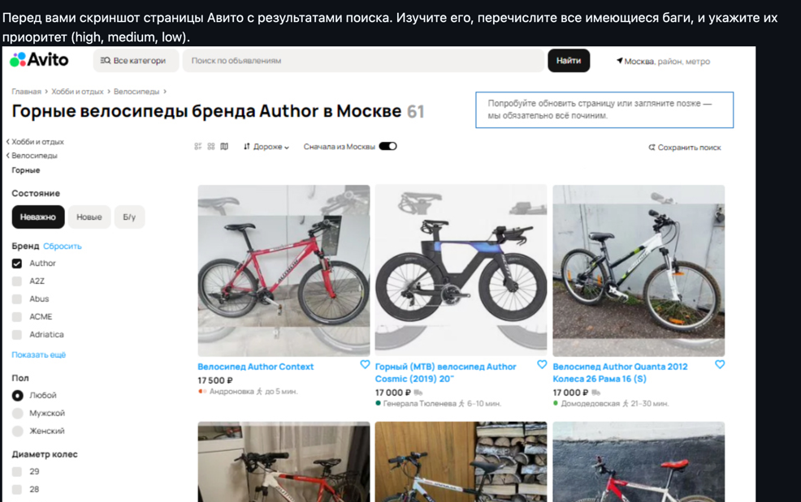

# Задание 1

Использовались следующие инструменты > python + pytest + allure

В файле [FirstTaskBAGS.md](FirstTaskBAGS.md) содержится баги по Заданию 1

# Задание 2

Тесткейсы - [TESTCASES.md](TESTCASES.md)

В файле [BAGS.md](BAGS.md) содержится баги по Заданию 2

Для запуска автотестов - pytest --alluredir=allure-results

Просмотр аллюр - отчета - allure serve allure-results

